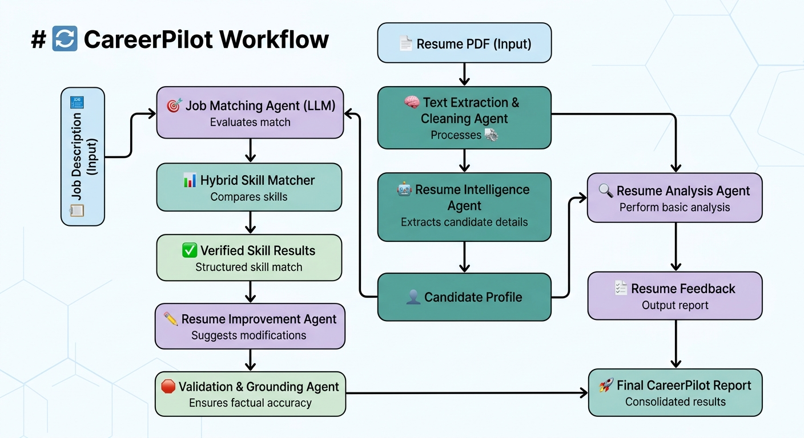

# 🚀 CareerPilot
### AI-Powered Resume Intelligence & Career Matching System

> 🎓 **Stark AI — SSSC'26 Final Capstone Project**  
> **Agentic AI Track**

CareerPilot is an AI-powered career assistant that analyzes a candidate's resume against a job description to identify matching skills, skill gaps, strengths, and resume improvement opportunities.

The project combines **LLM-based analysis, semantic similarity, deterministic skill verification, and evidence-based validation** to make career matching more reliable and explainable.

---

## ✨ Features

- 📄 Resume analysis and structured information extraction
- 🎯 AI-powered resume–job matching
- 🔍 Skill matching and verification
- 🧠 Semantic similarity analysis
- 🛡️ Evidence-based skill validation
- 📊 Combined candidate-job scoring
- ✍️ Source-grounded resume improvement suggestions
- 🚫 Filtering of unsupported claims and achievements

---

## 🏗️ Workflow

**Resume → Candidate Profile → LLM Job Matching → Skill Verification → Semantic Matching → Combined Score → Resume Analysis → Grounded Improvements → Final Report**



---

## 🛠️ Tech Stack

- **Python**
- **PyMuPDF**
- **Hugging Face**
- **Sentence Transformers**
- **LLMs**
- **NLP**
- **JSON**
- **Git & GitHub**
- **Google Colab / Jupyter Notebook**

---

## 📊 Example Result

| Metric | Score |
|---|---:|
| LLM Match Score | **85/100** |
| Verified Skill Score | **100/100** |
| Combined Score | **94/100** |

### Verified Skills

Python • Machine Learning • Generative AI • NumPy • Pandas • Scikit-learn • LLMs • Git • GitHub • FastAPI • React

### Verified Missing / Weak Skills

**None**

---

## 📂 Repository

```text
CareerPilot-AI/
├── SUDIKSHA_DAS_19901172025_CAPSTONE_PROJECT_STARKAI_SSSC'26.ipynb
├── CareerPilot_Workflow.png
├── requirements.txt
├── README.md
└── .gitignore

Clone the repository:

git clone https://github.com/sudiksha8639-debug/CareerPilot-AI.git
cd CareerPilot-AI
pip install -r requirements.txt

Then open the notebook:

SUDIKSHA_DAS_19901172025_CAPSTONE_PROJECT_STARKAI_SSSC'26.ipynb

and run the cells sequentially.

👩‍💻 Author

Sudiksha Das
B.Tech CSE (AI)
Indira Gandhi Delhi Technological University for Women

Stark AI — SSSC'26 | Final Capstone Project
